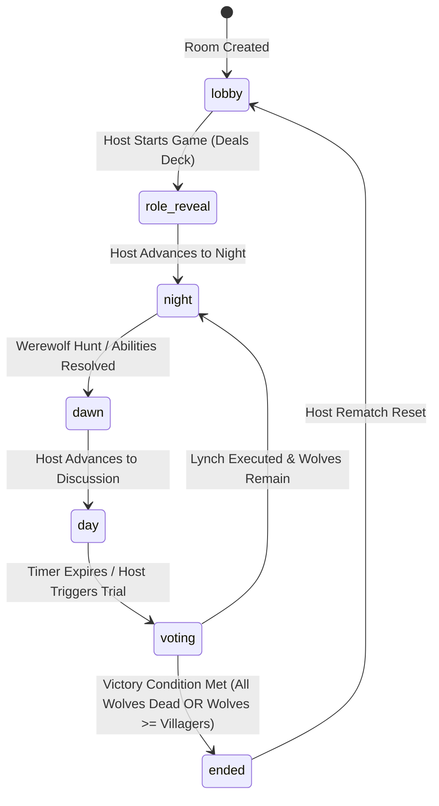

# Pocket Werewolf - Architecture & Design Specifications 🏛️

This document details the architectural design, state machines, data models, and communication protocols powering **Pocket Werewolf**.

---

## 1. High-Level Architecture Overview

Pocket Werewolf is a **100% Serverless (BaaS)** web application built on **React 18, Vite 5, Tailwind CSS, TypeScript, and Supabase**.

```
┌─────────────────────────────────────────────────────────────┐
│                    Client Layer (React 18 + PWA)            │
│  - React Context (GameContext, ThemeContext, LanguageContext)│
│  - 3D Card Engine & Responsive Touch Controllers             │
│  - Web Audio API Sound Synthesizer                          │
└──────────────┬───────────────────────────────▲──────────────┘
               │                               │
       PostgreSQL RPC / Inserts        Realtime WebSocket Push
               │                               │
┌──────────────▼───────────────────────────────┴──────────────┐
│                    Supabase Backend-as-a-Service            │
│  - PostgreSQL Database (Tables: rooms, players, actions...) │
│  - Row Level Security (RLS) Policies                        │
│  - Realtime Publications (supabase_realtime)                │
└─────────────────────────────────────────────────────────────┘
```

---

## 2. Game Phase State Machine

A match progresses through 7 discrete phases coordinated by the room host and synchronized across all clients via Supabase Realtime Channels:



---

## 3. Database Schema Design (`supabase/schema.sql`)

### Tables:
1. **`public.rooms`**:
   - `id (UUID)`: Unique room identifier.
   - `code (VARCHAR 8)`: Short 4-8 alphanumeric code used for joining.
   - `host_session_id (TEXT)`: Session ID of the game room creator.
   - `status (VARCHAR 32)`: Current phase (`lobby`, `role_reveal`, `night`, `dawn`, `day`, `voting`, `ended`).
   - `round (INT)`: Active day/night cycle count.
   - `deck (JSONB)`: Active configuration of role distribution.
   - `settings (JSONB)`: Durations, self-protect flags, anonymous voting flags.
   - `winner (VARCHAR 32)`: Winning team (`good`, `evil`, `draw`).

2. **`public.players`**:
   - `id (UUID)`: Player identifier.
   - `room_id (UUID)`: Foreign key referencing `rooms.id`.
   - `session_id (TEXT)`: Browser LocalStorage session identifier.
   - `name (VARCHAR 50)`: Player nickname.
   - `avatar (TEXT)`: Chosen emoji icon.
   - `is_host (BOOLEAN)`: True for the room moderator.
   - `is_ready (BOOLEAN)`: Ready toggle state in lobby.
   - `is_alive (BOOLEAN)`: Survival state.
   - `role (VARCHAR 50)`: Secret assigned role.
   - `team (VARCHAR 20)`: `'good'` or `'evil'`.
   - `death_reason (TEXT)`: `'night_kill'`, `'lynched'`, `'witch_poison'`, `'hunter_shot'`.

3. **`public.night_actions`**:
   - Stores nightly role submissions (`werewolf_kill`, `seer_inspect`, `doctor_heal`, `witch_kill`).

4. **`public.votes`**:
   - Tracks daily town trial execution ballots cast per round with unique constraint on `(room_id, round, voter_id)`.

5. **`public.game_logs`**:
   - Real-time narration event log with targeted visibility.

---

## 4. Real-time Synchronization Protocol

### Supabase Channels:
- Each room subscribes to a dedicated channel: `room:{room_id}`.
- Subscribes to PostgreSQL database changes on `rooms`, `players`, `night_actions`, `votes`, and `game_logs`.
- When database records update, Supabase pushes WebSocket events (`INSERT`, `UPDATE`, `DELETE`) to all connected peers within `< 50ms`.

---

## 5. Web Audio Engine (`src/utils/audio.ts`)

To provide zero-latency atmospheric sound without bundling hundreds of megabytes of MP3 files, the audio system utilizes the **HTML5 Web Audio API**:
- **Wolf Howl:** Dual oscillator frequency sweep with low-pass resonance filter.
- **Church Bells:** Harmonic sine frequency blend with exponential decay envelopes.
- **Death Gong:** Deep sub-bass square waves modulated with white noise burst.
- **Victory Fanfare:** Tri-tone harmonic chord cadence.
