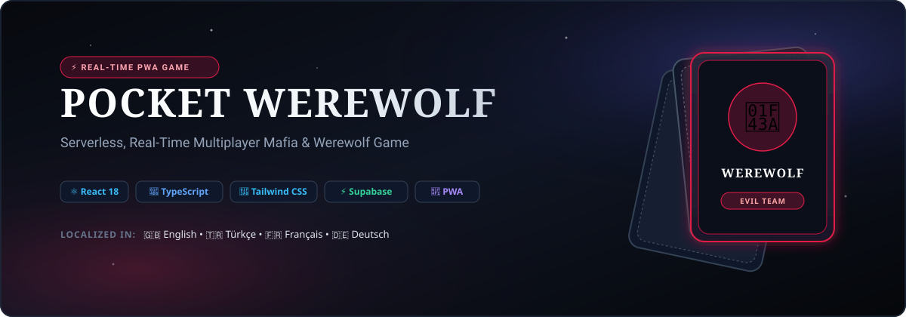
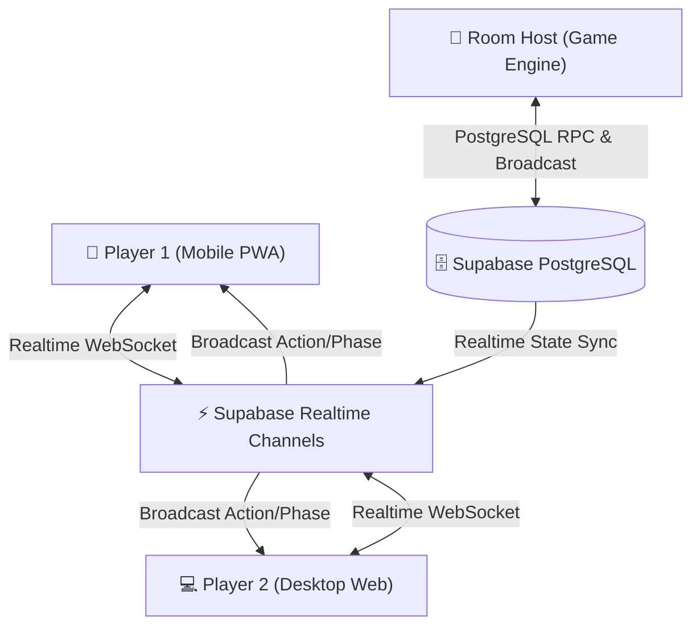

<div align="center">



# 🐺 Pocket Werewolf

**Modern, Serverless & Real-Time Multiplayer Werewolf / Mafia Progressive Web App (PWA)**

[](https://github.com/AtaCanYmc/pocket-werewolf/actions/workflows/ci-cd.yml)
[](https://react.dev/)
[](https://www.typescriptlang.org/)
[](https://tailwindcss.com/)
[](https://supabase.com/)
[](https://web.dev/progressive-web-apps/)
[](https://opensource.org/licenses/MIT)
[](#-internationalization-i18n)

[Play Live Demo](https://AtaCanYmc.github.io/pocket-werewolf/) • [Report Bug](https://github.com/AtaCanYmc/pocket-werewolf/issues) • [Request Feature](https://github.com/AtaCanYmc/pocket-werewolf/issues)

</div>

---

## 📖 Overview

**Pocket Werewolf** is a reimagined, serverless adaptation of the classic social deduction game *Werewolf (Mafia)*. 

By replacing traditional dedicated Node.js/Socket.io backend servers with **Supabase (PostgreSQL + Realtime Channels/Presence)** and bundling the client with **Vite, React 18, and Tailwind CSS**, Pocket Werewolf delivers zero-latency multiplayer gameplay with zero hosting costs, full offline PWA caching, and cross-platform mobile/desktop responsiveness.

---

## ✨ Key Features

- ⚡ **Zero-Server BaaS Architecture:** Powered entirely by client-side state management orchestrated via Supabase Realtime Channels. No server maintenance or hosting overhead.
- 🛡️ **100% Type-Safe TypeScript:** Strict compiler settings with end-to-end models for Rooms, Players, Night Actions, Votes, and Game Logs.
- 📱 **Mobile-First Progressive Web App (PWA):** Installable on iOS/Android home screens with safe area padding, touch target ergonomics, and offline service worker caching.
- 🌓 **Dark & Light Mode Engine:** Atmospheric Gothic Dark theme by default with seamless toggle to Daylight Village theme.
- 🌐 **4-Language Localization (i18n):** Complete in-game language switching for **English (🇬🇧)**, **Türkçe (🇹🇷)**, **Français (🇫🇷)**, and **Deutsch (🇩🇪)**.
- 🎴 **3D Interactive Card Flip:** Smooth CSS 3D card perspective for secret role reveals without screen peeking.
- 🎵 **Procedural Web Audio API:** Synthesized atmospheric sound effects (wolf howls, church bells, death gongs, victory fanfares) without bulky MP3 assets.
- 🔄 **Automated CI/CD:** GitHub Actions pipeline for continuous type checking, production packaging, and one-click GitHub Pages deployment.

---

## 🏛️ System Architecture



---

## 🎮 Game Phases & Flow

| Phase | Description | Highlights |
| :--- | :--- | :--- |
| **🏰 1. Lobby** | Players join with 4-letter room codes or instant QR/URL sharing. | Dynamic Deck Builder, Preset templates, Ready status toggle, Player kick moderation. |
| **🎴 2. Role Reveal** | Each player receives their secret role card. | 3D Interactive Card Flip with touch & keyboard controls. |
| **🌙 3. Night Phase** | Village falls asleep; special roles wake up. | Werewolf hunting pack, Seer psychic inspection, Doctor heal protection, Witch potions. |
| **🌅 4. Dawn Report** | Village awakens to discover the night's casualties. | Dramatic victim reveal with obituary roles and survival announcements. |
| **☀️ 5. Day Discussion** | Village debates and accuses suspects. | Synced discussion countdown timer, Host pause/resume controls, suspect tagging. |
| **⚖️ 6. Town Hall Trial** | Village votes to execute a suspect. | Real-time live vote tallying, instant execution animations, tied vote handling. |
| **🏆 7. Game Over** | Victory declared for Villagers or Werewolves. | Victor fanfare, confetti animations, full identity reveal, one-click rematch. |

---

## 🎭 Roles Roster

### 🟢 Good Team (Villagers)
- **Villager (👨‍🌾):** Has no special night powers. Uses deduction and voting during the day to lynch werewolves.
- **Seer (🔮):** Inspects one player every night to learn whether they belong to the Evil or Good team.
- **Doctor (💉):** Protects one player each night from werewolf attacks (can protect themselves).
- **Witch (🧙‍♀️):** Brews deadly night poison to eliminate suspects.
- **Hunter (🏹):** Fires a final shot upon death, taking down another target.
- **Mason (🛡️):** Secret society members who recognize each other at the start of the game.

### 🔴 Evil Team (Werewolves)
- **Werewolf (🐺):** Wakes up each night with fellow wolves to choose a villager to hunt.
- **Dream Wolf (🌙):** A werewolf asleep in slumber who awakens when fellow wolves perish.
- **Sorceress (✨):** Searches for the Seer at night to assist the werewolf pack.
- **Minion (🦇):** Loyal ally of the werewolves who works to mislead town trials.

---

## 🚀 Quick Start Guide

### Prerequisites
- Node.js `20.x` or higher
- npm `10.x` or higher
- Free Supabase account ([supabase.com](https://supabase.com))

### 1. Clone Repository
```bash
git clone https://github.com/AtaCanYmc/pocket-werewolf.git
cd pocket-werewolf
```

### 2. Install Dependencies
```bash
npm install
```

### 3. Setup Supabase Database
1. Go to your [Supabase Dashboard](https://supabase.com/dashboard) and create a project.
2. Navigate to the **SQL Editor** tab.
3. Paste the contents of [`supabase/schema.sql`](./supabase/schema.sql) and click **Run**.
4. Copy your **Project URL** and **Anon Public Key** from **Project Settings → API**.

### 4. Configure Environment
Create a `.env` file based on `.env.example`:
```env
VITE_SUPABASE_URL=https://your-project-ref.supabase.co
VITE_SUPABASE_ANON_KEY=your-anon-public-key
```
*(Alternatively, enter credentials directly in the in-app **Settings (⚙️)** modal)*

### 5. Launch Development Server
```bash
npm run dev
```

Open [http://localhost:5173](http://localhost:5173) in your browser.

---

## 🛠️ Tech Stack & Dependencies

| Layer | Technologies |
| :--- | :--- |
| **Frontend Framework** | [React 18](https://react.dev/) + [Vite 5](https://vitejs.dev/) |
| **Language** | [TypeScript 7](https://www.typescriptlang.org/) (Strict ES2022) |
| **Styling & Icons** | [Tailwind CSS 3](https://tailwindcss.com/) + [Lucide React](https://lucide.dev/) |
| **Backend & Realtime** | [Supabase](https://supabase.com/) (PostgreSQL + Realtime Channels) |
| **PWA & Offline** | [vite-plugin-pwa](https://vite-pwa-org.netlify.app/) (Workbox Service Worker) |
| **Audio Synthesis** | Native Web Audio API (Zero external MP3 dependencies) |
| **CI / CD Pipeline** | GitHub Actions (`.github/workflows/ci-cd.yml`) |

---

## 📂 Project Directory Structure

```
pocket-werewolf/
├── .github/
│   └── workflows/
│       └── ci-cd.yml          # GitHub Actions CI/CD Pipeline
├── public/
│   ├── assets/roles/          # Role artwork assets
│   ├── icons/                 # PWA application icons (192, 512, logo)
│   ├── banner.svg             # Repository vector banner
│   └── favicon.ico            # Favicon
├── src/
│   ├── components/
│   │   ├── common/            # Header, 3D CardFlip, TimerBar
│   │   ├── game/              # 6 Game Phase views
│   │   ├── lobby/             # Room Lobby & Role Deck Builder
│   │   └── modals/            # Settings, Role Guide, Share dialogs
│   ├── config/
│   │   └── roles.ts           # Typed Role definitions & Presets
│   ├── context/
│   │   ├── GameContext.tsx    # Supabase Realtime State Provider
│   │   ├── ThemeContext.tsx   # Dark / Light Theme Manager
│   │   └── LanguageContext.tsx # 4-Language i18n Manager
│   ├── i18n/
│   │   └── translations.ts    # En, Tr, Fr, De Localization Dictionary
│   ├── lib/
│   │   └── supabase.ts        # Supabase Client & Credential Persistence
│   ├── services/
│   │   └── gameEngine.ts      # Core Werewolf Game Engine & Rules
│   ├── types/
│   │   └── game.ts            # Strict TypeScript Interfaces & Types
│   ├── utils/
│   │   ├── audio.ts           # Web Audio API Sound Synthesizer
│   │   └── session.ts         # Player Profile & Session Persistence
│   ├── App.tsx                # Root App Component & Phase Router
│   ├── main.tsx               # DOM Entrypoint
│   └── index.css              # Tailwind Directives & Animations
├── supabase/
│   └── schema.sql             # PostgreSQL Schema, RLS & Realtime
├── index.html
├── package.json
├── tailwind.config.js
├── tsconfig.json
└── vite.config.js
```

---

## 🌐 Internationalization (i18n)

Pocket Werewolf supports instant runtime localization without page reloads:
- 🇬🇧 **English (`en`)**
- 🇹🇷 **Türkçe (`tr`)**
- 🇫🇷 **Français (`fr`)**
- 🇩🇪 **Deutsch (`de`)**

To add a new language, simply add a language code entry to [`src/i18n/translations.ts`](./src/i18n/translations.ts).

---

## 🚢 Deployment

### Deploy to GitHub Pages (Automated)
1. Push your repository to GitHub.
2. In your repo settings, go to **Settings → Pages**.
3. Under **Build and deployment > Source**, select **"GitHub Actions"**.
4. Every push to `main` will automatically trigger `.github/workflows/ci-cd.yml` and publish your live app.

### Deploy to Vercel / Netlify / Cloudflare
1. Connect your GitHub repository.
2. Set Build Command: `npm run build`
3. Set Output Directory: `dist`
4. Set Environment Variables: `VITE_SUPABASE_URL` and `VITE_SUPABASE_ANON_KEY`

---

## 🤝 Contributing

Contributions, issues, and feature requests are welcome! Feel free to check the [issues page](https://github.com/AtaCanYmc/pocket-werewolf/issues).

1. Fork the Project
2. Create your Feature Branch (`git checkout -b feature/AmazingFeature`)
3. Commit your Changes (`git commit -m 'feat: add some AmazingFeature'`)
4. Push to the Branch (`git push origin feature/AmazingFeature`)
5. Open a Pull Request

---

## 📄 License

Distributed under the **MIT License**. See [`LICENSE`](./LICENSE) for more information.

<div align="center">
  <sub>Built with 🐺 by <a href="https://github.com/AtaCanYmc">AtaCanYmc</a> and the open-source community.</sub>
</div>
